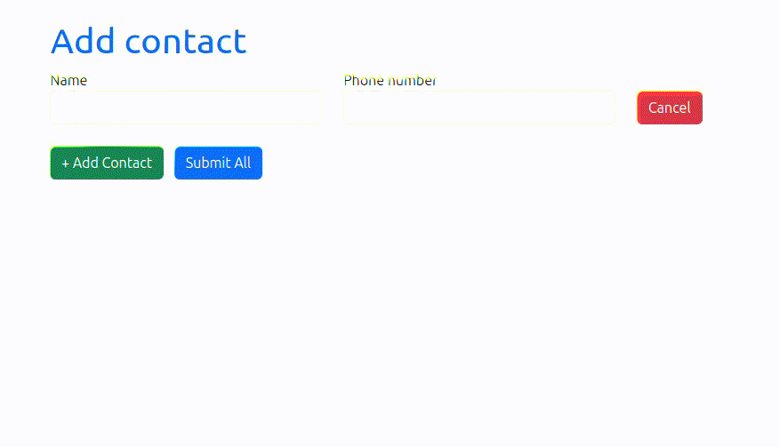

# Динамичская форма

Здесь представлен вариант динамической формы, которую можно использовать в приложениях построеных на фреймворке Django. Форма представлена на примере модели контакта в телефоне. 

# Технологии

 1. Python 3.11
 2. Django 5.0.3
 3. HTMX
 4. Bootstrap 5.3.3

# Особенности

В форме можно добавлять поля, например если в базе данных нужно сохранить сразу нестколько контактов или при сохранении кулинарного рецепта вы указываете ингридиенты, то добавляете необходимое количество полей.

